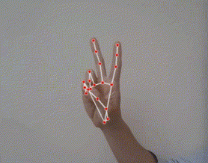

# Hand Sign Number Detection

## Overview

This project is a real-time hand gesture recognition system that detects and recognizes hand gestures representing numbers from 0 to 5 using Mediapipe library.

The system is designed to capture video frames from the user's camera and apply a series of image processing techniques to isolate the hand region from the background. Once the hand region is extracted, the system uses the hand landmarks detected by Mediapipe to recognize the hand gesture.

## Requirements

The project requires Python 3.7 or above **(NOT WORKING ON PYTHON 3.11, mediapipe library is not compatible with Python 3.11)**, along with several libraries including:

- opencv
- numpy
- mediapipe

### Author

- LinkedIn - [Ömer Fatih Bülbül](https://www.linkedin.com/in/ömer-fatih-bülbül-74a890236/)
- Twitter - [fatihbulbul91](https://twitter.com/fatihbulbul91)
